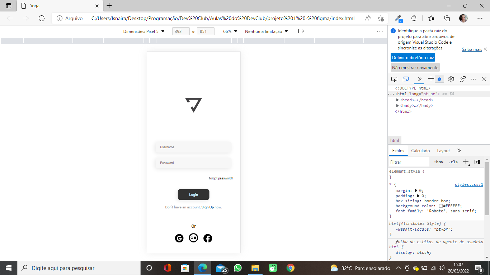

# Yoga

> Project result - figma - Dev Club class Yoga.

## 🤝👩🏻 Collaborator

<table>
  <tr>
    <td align="center">
      <a href="#">
         
        
          <b>Isnaíra Souza</b>
        
      </a>
    </td>   
  </tr>
</table>
